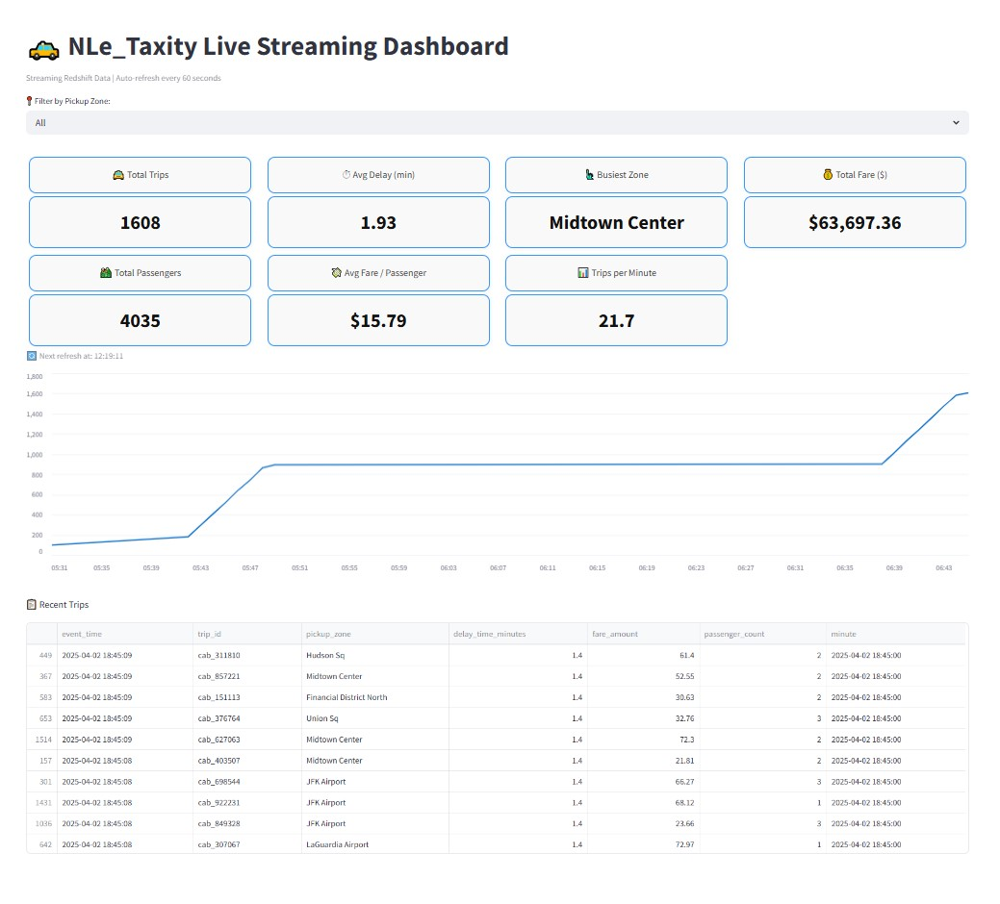
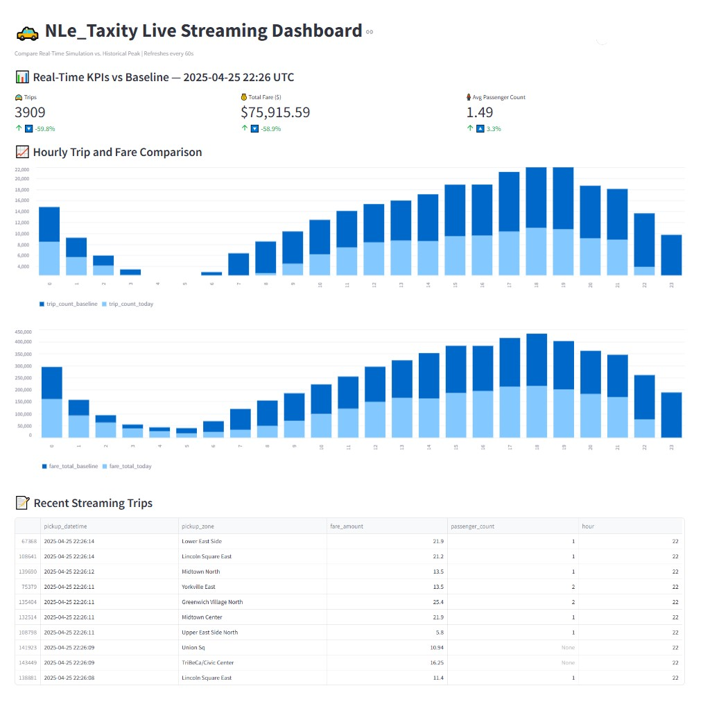

## 🚖 N_LeTaxity: NYC Taxi Streaming + Batch Data Pipeline

### TL;DR

🚖 Cloud-native streaming and batch data pipeline with dbt
📦 Redshift + Snowflake performance benchmark
📊 Real-time Streamlit dashboard

**N_LeTaxity** is a full-stack, cloud-native data engineering project showcasing modern ETL/ELT practices by combining streaming and batch pipelines. The project ingests and processes NYC Taxi data from both an external historical source and a Python-based real-time simulator into scalable S3 data lake. Then modeled and analyzed in Redshift and Snowflake via a comprehensive benchmark and data modeling layer built with dbt. Key insights are then surfaced in a real-time dashboard built with Streamlit

---

## 📊 Project Highlights

* **Data Ingestion**: Engineered a dual-pipeline system with Python to simulate live data, using Kinesis Firehose for real-time streaming and AWS Glue for scheduled batch ingestion from a data lake.
* **Data Lake & Storage**: Built a scalable data lake on Amazon S3 for raw and processed data, with DynamoDB providing lightweight observability and audit logging.
* **Data Transformation**: Modeled and transformed data using AWS Glue and dbt to create data models with staging, intermediate and data mart layers from raw source data.
* **Data Warehousing**: Leveraged Redshift Serverless for both streaming and batch analytics, while using Snowflake for a one-time bulk load and performance benchmark.
* **Orchestration**: Used AWS Step Functions to orchestrate and automate the end-to-end data pipeline.
* **Visualization**: Created a Streamlit dashboard to visualize key metrics and compare streaming data against a historical baseline.

Note: Streaming operates near-real-time (sub-minute) using Serverless AWS services.

---

## 🗺️ Architecture Diagram

---

## 📂 Project Directory Structure

.
├── .gitignore
├── analytics/
│   ├── notebooks/
│   └── streamlit/
│       └── dashboard.py
├── config/
│   └── env.redshift.dev.sh
├── dbt/
│   ├── analyses/
│   ├── macros/
│   ├── models/
│   │   ├── intermediate/
│   │   ├── marts/
│   │   └── staging/
│   └── tests/
├── docs/
│   ├── arch-diagrams/
│   │   └── N_LeTaxity_Architechture_Diagram.jpg
│   ├── metrics/
│   │   └── Snowflake_vs_Redshift_Benchmark.jpg
│   └── readme_images/
├── scripts/
│   ├── batch/
│   │   └── glue_job_script.py
│   └── streaming/
│       ├── streaming_simulator.py
│       └── lambda_function_streaming.py
└── sql/
    ├── ddl/
    │   ├── redshift_ddl.sql
    │   └── snowflake_ddl.sql
    └── adhoc/
        ├── redshift_queries.sql
        └── snowflake_queries.sql

---

### 🌐 Technologies Used

#### **AWS Services**
* **Amazon S3**: Scalable Data Lake for raw and processed data.
* **Amazon Kinesis Data Firehose**: Streaming ingestion of near real-realtime ingestion of high-velocity data.
* **AWS Glue**: Serverless ETL for batch data transformation and Data Catalog for metadata management.
* **AWS Lambda**: Serverless compute for data enrichment and transformation.
* **Amazon Redshift Serverless**: Centralized data warehouse for analytics.
* **AWS Step Functions**: Managed workflow orchestration for multi-step ETL process.
* **Amazon EventBridge**: Simple scheduled triggers for pipeline automation.
* **Amazon DynamoDB**: Lightweight control and audit logging for pipelines.
* **Amazon Athena**: Ad-hoc SQL querying directly on data in S3.

#### **Other Technologies & Tools**
* **dbt (Data Build Tool)**: Used for data modeling, transformation, and running benchmark queries. providing robust, version-controlled analytics code base
* **Snowflake**: Cloud-native data warehouse leveraged for a one-time bulk load and performance benchmark against Redshift.
* **Python**: Used for data simulation and scripting.
* **Streamlit**: Dashboard and KPI visualization.
---

## 📈 Data Model & Schema

The data models for this project are managed and documented using **dbt**. The project follows a multi-layered data model (staging, intermediate, and marts) to ensure a single source of truth for analytics.

* **Staging Models:** These are the initial building blocks of the project, where raw data is cleaned and standardized. They use basic transformations like type casting and column renaming.
* **Intermediate Models:** This layer brings together the staging models to perform more complex calculations and joins, making the final mart models more readable and efficient.
* **Marts (or Mart Models):** This is the top layer where business-defined entities are constructed and made readily available for end-user applications like dashboards.

You can view the full documentation, including all tables, views, data lineage, and column descriptions, here:

[**View dbt Project Documentation**](http://nle-dbt-docs.s3-website-us-east-1.amazonaws.com/#!/overview)

## 📂 Data Sources

* **Historical Data:** Monthly NYC Yellow & Green taxi trip parquet files from [https://www.nyc.gov/](https://www.nyc.gov/)
* **Streaming Data:** Simulated live taxi trip events based on historical data.
---

## 📊 Snowflake vs. Redshift Performance Snapshot
This benchmark includes a small set of representative ad hoc queries to compare query performance between Redshift and Snowflake under equivalent schema and workload conditions. While not comprehensive, it demonstrates the adaptability of workloads across data platforms.
* Results of the same adhoc queries run across Redshift and Snowflake.
  

## 📈 KPI Metrics in Dashboard

* Trip count
* Total fare revenue
* Average trip delay
* Passengers carried
* Trips per minute
* Real-time vs baseline comparison
* Cumulative trip chart

---

## 📸 Sample Dashboard Screenshot

---

## 📚 Future Improvements

* **Integrate EMR Spark and Hive** for batch processing, providing a scalable alternative to AWS Glue for large-scale data transformation.
* Cost optimization: Iceberg tables or Athena for streaming.
* Predictive analytics: model surge demand zones.
* More realistic simulation based on historical patterns.

### ➡️ Phase II: EMR Migration

A planned next step for this project is to re-architect the batch processing pipeline to use **EMR with Spark and Hive**. This will serve as a key learning exercise and provide a comparison of the performance and cost-effectiveness of EMR as a serverless data transformation engine compared to AWS Glue. This phase will involve:
- Building an EMR cluster with Spark and Hive on both EC2 and EMR Serverless for comparision.
- Migrating the existing Glue jobs to Spark and Hive scripts.
- Documenting the performance and cost differences between the two approaches.

## 💡 Inspiration

> "Modern Data Engineering: Combining batch + streaming for near real-time decision making."

---

## 💬 Credits

* NYC Taxi and Limousine Comission.

---

### 🔗 Connect with me

* LinkedIn: https://www.linkedin.com/in/le-nguyen-v/
* GitHub: https://github.com/tropily/Zen_Clarity