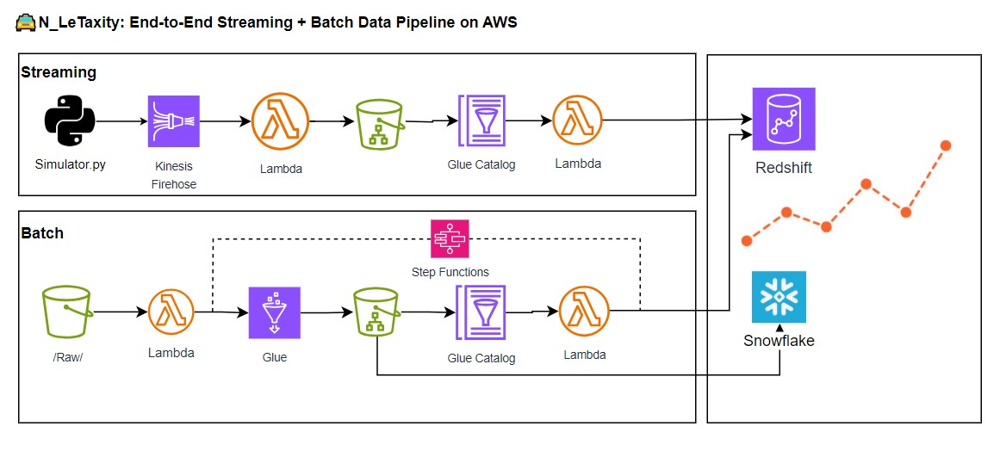
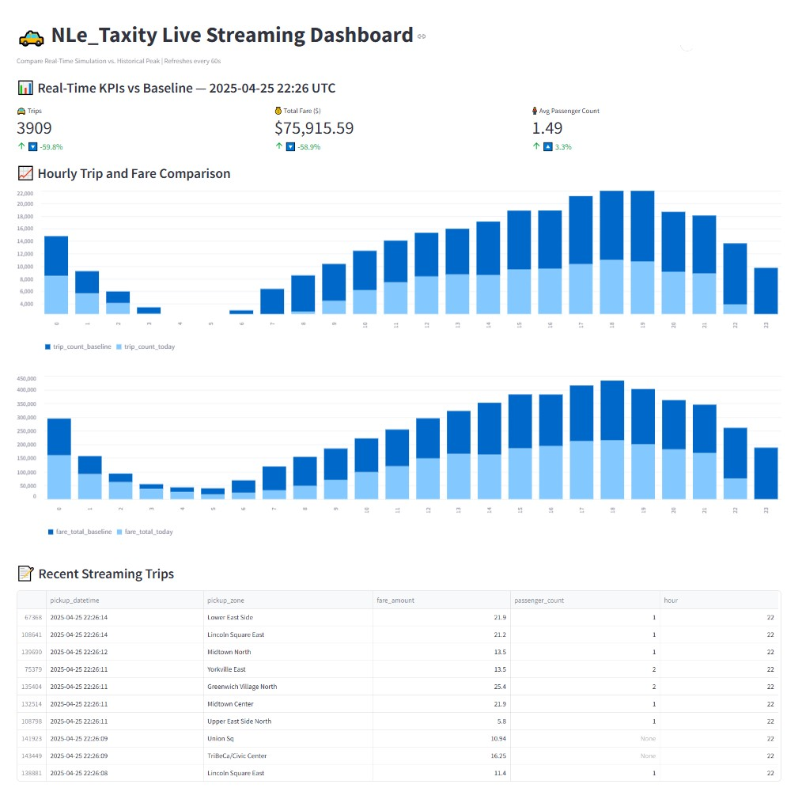

## 🚖 N_LeTaxity: NYC Taxi Streaming + Batch Data Pipeline

### TL;DR

🚖 Cloud-native pipeline built on AWS using NYC Taxi data  
📦 Redshift + Snowflake data warehouses benchmarked  
📊 Real-time Streamlit dashboard with batch + streaming insights  

**N_LeTaxity** is a full-stack, cloud-native data engineering project showcasing streaming and batch pipelines using AWS services, Redshift Serverless, and Snowflake. It ingests and processes NYC Taxi data in real time, stores it in a scalable data lake, and surfaces analytics through Redshift, Snowflake, and Streamlit dashboards.

---

## 📊 Project Highlights

* **Python**: Simulation script to emulate live NYC taxi traffic.
* **Kinesis Firehose**: Streaming ingestion of real-time trip data.
* **S3 + AWS Glue + Step Functions**: Batch ingestion and ETL orchestration.
* **S3 Data Lake**: Organized storage into raw/ and processed/ zones.
* **Redshift Serverless**: Centralized analytics warehouse for both streaming and batch data.
* **Snowflake**: Alternative Cloud data warehouse integration for benchmark against Redshift.
* **DynamoDB**: Lightweight control and audit logs for improved pipeline observability and recovery.
* **AWS Step Functions**: End-to-end orchestration of automated ETL workflows.
* **Streamlit**: Real-time dashboard with KPIs, graphs, and streaming vs baseline comparisons.

Note: Streaming operates near-real-time (sub-minute) using Serverless AWS services.

---

## 🗺️ Architecture Diagram

---

## 📂 Project Directory Structure

├── 📄 README.md — Project documentation  
├── 📊 analytics — Streamlit dashboards & analytics scripts  
├── 🗂 Archived — Historical notes, lessons learned, old reports & test scripts  
├── 🖼️ docs — Architecture diagrams, performance charts, streaming KPIs visuals  
├── 📝 scripts — Batch & Streaming data pipeline code  
│   ├── batch — Lambda scripts for Redshift ETL & Glue triggers  
│   ├── helpers — Shared libraries (e.g., pipeline logger layer)  
│   └── streaming — Streaming ingestion & simulation Lambda functions  
├── 🗄️ sql — SQL DDL & queries  
│   ├── redshift — Redshift DDL, ETL, and adhoc queries  
│   ├── snowflake — Snowflake DDL, ETL, and adhoc queries  
│   └── benchmark — Redshift vs. Snowflake performance   

---

## 🌐 AWS Services Used
* **Amazon S3**: Data Lake for raw and processed trip data.
* **AWS Glue Data Catalog**: Metadata management for structured querying.
* **AWS Glue ETL**: Batch data transformation.
* **Amazon Kinesis Data Firehose**: Streaming ingestion to S3.
* **AWS Lambda**: Serverless compute for data enrichment and transformation.
* **Amazon Redshift Serverless**: Centralized data warehouse for analytics.
* **Snowflake**: Alternative cloud-native data warehouse integration.
* **AWS Step Functions**: Managed ETL workflow orchestration.
* **Amazon EventBridge**: Scheduled triggers for streaming pipeline refresh.
* **Amazon DynamoDB**: Lightweight control and audit logging for pipelines.
* **Amazon Athena**: Ad-hoc SQL queries directly on S3-based raw/processed data.
* **Streamlit**: Real-time dashboard and KPI visualization.

---

## 📂 Data Sources

* **Historical Data:** Monthly NYC Yellow & Green taxi trip parquet files from [https://www.nyc.gov/](https://www.nyc.gov/)
* **Streaming Data:** Simulated live taxi trip events based on historical data.

---

## 📊 Redshift Key Tables and Views

* `public.taxi_trip_data`: batch cleaned historical data.
* `public.taxi_streaming_trips`: streaming incoming trip data.
* `public.taxi_zone_lookup`: taxi zones lookup.
* `public.taxi_trip_data_vw`: summarized batch trips.
* `public.taxi_streaming_trips_vw`: summarized streaming trips.
* `public.taxi_trip_simulated_today_vw`: simulated today trips for live comparison.
* `public.taxi_trip_top_traffic_vw`: baseline busiest day for benchmarking.

## 📊 Snowflake Key Tables and Views

* 'NYC_TAXI_DB.BATCH_DATA.TRIP_DATA: batch trip data ingested from S3
* 'NYC_TAXI_DB.BATCH_DATA.TAXI_ZONE_LOOKUP: taxi zone lookup ingested table from S3
* 'NYC_TAXI_DB.BATCH_DATA.TAXI_TRIP_DATA_VW: trip data view

---

## 📊 Snowflake vs. Redshift Performance Snapshot
This benchmark includes a small set of representative ad hoc queries to compare query performance between Redshift and Snowflake under equivalent schema and workload conditions. While not comprehensive, it demonstrates the adaptability of workloads across data platforms.
* Results of the same adhoc queries run across Redshift and Snowflake.
  

## 📈 KPI Metrics in Dashboard

* Trip count
* Total fare revenue
* Average trip delay
* Passengers carried
* Trips per minute
* Real-time vs baseline comparison
* Cumulative trip chart

---

## 📸 Sample Dashboard Screenshot

---

## 📚 Future Improvements

* Cost optimization: Iceberg tables or Athena for streaming.
* Predictive analytics: model surge demand zones.
* More realistic simulation based on historical patterns.

## 💡 Inspiration

> "Modern Data Engineering: Combining batch + streaming for near real-time decision making."

---

## 💬 Credits

* NYC Taxi and Limousine Comission.

---

### 🔗 Connect with me

* LinkedIn: https://www.linkedin.com/in/le-nguyen-v/
* GitHub: https://github.com/tropily/
