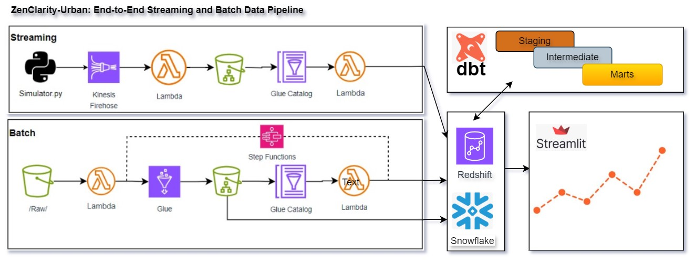
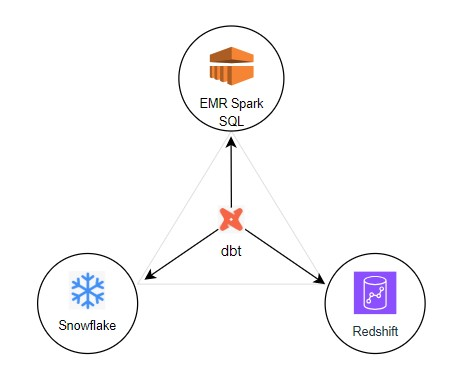
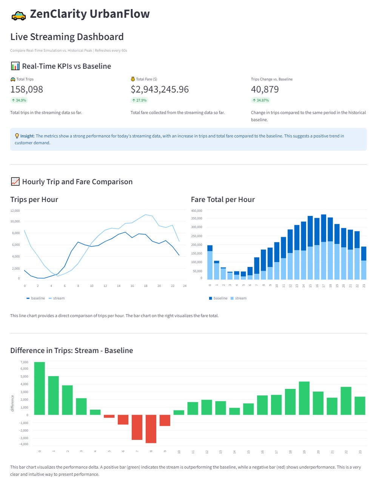

# 🌆 ZenClarity-UrbanFlow — NYC Taxi Data Engineering Project

**A modern data engineering platform combining streaming + batch pipelines, dbt-powered transformations, and multi-engine analytics across Redshift Serverless, Snowflake, and EMR Spark**
Designed for **portability, cost-performance benchmarking, and real-time insights** delivered via Streamlit

- 🚖 **Pipelines**: Streaming (Kinesis) + Batch (Glue, EMR Spark)
- 🗄️ **Data Lake & Warehouses**: S3 + Redshift, Snowflake, Spark SQL
- 📊 **dbt Modeling**: Staging → Intermediate → Marts
- 🌐 **Portability**: One dbt codebase across Redshift, Snowflake, EMR Spark SQL
- 🧪 **Sanity Check**: Cross-engine runtime/cost notes in `/docs/benchmarks/`
- 📈 **Visualization**: Streamlit dashboard with KPIs & real-time vs baseline

---

## 🗺️ Architecture



---

## 🌐 Portability — One dbt Codebase → Three Engines

**One dbt codebase** runs on **Snowflake**, **Redshift**, and **EMR Spark**, enabling true engine flexibility with no rewrites. This design lets you benchmark cost/performance across platforms and keep models maintainable as a single source of truth



**Why it matters**
- Avoids **vendor lock-in** and simplifies migrations
- Enables **apples-to-apples benchmarking** across engines
- Keeps analytics **consistent and DRY** with shared models/macros

---

## 📊 Project Highlights

- **Data Ingestion**
  - *Streaming*: Python simulator + **Kinesis Firehose** for near real-time ingestion
  - *Batch*:
    - **AWS Glue** for serverless ETL.
    - **EMR Spark** jobs (PySpark/Hive) for scalable, distributed batch processing

- **Data Lake & Storage**: Central **Amazon S3** data lake; **DynamoDB** for observability and audit logging

- **Data Transformation**: ETL with **AWS Glue** and **EMR Spark**; ELT with **dbt** (multi-layer: staging, intermediate, marts)

- **Data Warehousing Engines**
  - **Redshift Serverless** for streaming & batch analytics
  - **Snowflake** for bulk loading + benchmarking
  - **EMR Spark SQL** for distributed queries and performance testing

- **Unified Transformation Layer**: A single **dbt project** runs seamlessly across all engines:
  - **Redshift** and **Snowflake** using native dbt adapters
  - **EMR Spark** via **Spark Thrift Server (STS)** with **Hive Metastore (Glue Catalog)** for schema management.
  This ensures portability, consistency, and reduced maintenance overhead

## Orchestration

- **AWS Step Functions** — production path that orchestrates **Glue** jobs to ingest from source and load into **Amazon Redshift**.

- **Apache Airflow (Docker, local)** — parallel/alternative path that triggers **EMR Spark** batch runs for heavier or custom Spark workloads.
  - DAG: `emr_ec2_submit_step` submits a `spark-submit` step to an existing EMR (EC2) cluster and waits for completion.
  - Config: AWS creds from host `~/.aws` (mounted read-only), defaults via Airflow **Variables**, run-time overrides via `dag_run.conf` (e.g. `{"year":"2024","month":"10","cab_type":"yellow"}`).

**Why both?** Step Functions powers the Glue-based production pipeline; Airflow demonstrates portability and scale-up options using EMR Spark, and serves as a developer-friendly orchestrator for iterative jobs.
flows

- **Visualization**: **Streamlit** surfaces KPIs and real-time vs baseline comparisons

---

## 📂 Repo Structure

```text
ZenClarity-UrbanFlow/
├─ analytics/
├─ config/
├─ dbt/
├─ docs/
│  ├─ arch_diagrams/
│  ├─ benchmarks/
│  ├─ metrics/
│  └─ runbooks/                 # gitignored
├─ infrastructure/
│  ├─ emr/                      
│  ├─ glue/
│  ├─ redshift/
│  └─ snowflake/
├─ scripts/
│  ├─ airflow/
│  │  ├─ emr_ec2_submit_step.py
│  │  └─ vars_emr_ec2.json
│  ├─ airflow_disabled/         # (ignored)
│  ├─ batch/
│  │  ├─ glue_jobs/
│  │  └─ emr_spark/
│  ├─ emr_jobs/
│  │  └─ emr_process_trip_data.py
│  ├─ streaming/
│  └─ helpers/
├─ tools/
│  └─ airflow-docker/
│     ├─ docker-compose.yml
│     ├─ Dockerfile
│     ├─ logs/                  # ignored
│     └─ plugins/               # ignored
└─ README.md

---

## 📈 Data Models & dbt

This project follows a **multi-layered dbt modeling pattern** for maintainable, scalable analytics code

- **Staging**: cleans raw data, enforces schema
- **Intermediate**: joins + transformations for readability/efficiency
- **Marts**: business-defined entities for analytics (facts & dims)

📑 **Documentation & lineage**: The entire dbt project is documented and includes a full lineage graph, showcasing the flow of data from source to dashboard
[View dbt Project Documentation (S3 Hosted)](http://nle-dbt-docs.s3-website-us-east-1.amazonaws.com/#!/overview)

---

## 📈 Dashboard KPIs (Streamlit)

- Trips count
- Total fare revenue
- Average trip delay
- Passengers carried
- Trips per minute
- Real-time vs baseline comparison
- Cumulative trip chart

**Screenshots:**


---

## 🌐 Technologies Used

**AWS Services:**
S3 • Kinesis Firehose • Glue • Lambda • Step Functions • EventBridge • DynamoDB • Athena • Redshift Serverless • EMR (Spark, Hive, STS)

**Other Tools:**
dbt • Snowflake • Python • Streamlit

---

## 📚 Roadmap

- **Next Phase: Documentation & Tuning**
  - Extend docs with tuning experiments (partitioning, compaction, Spark optimizations)

- **Future Enhancements**
  - **AI-Powered Natural Language → SQL Assistant (AWS-native)**
    - Explore **Amazon Bedrock** for NL→SQL translation, grounded in dbt metadata + Glue Catalog
    - Use **Knowledge Bases** + **OpenSearch Serverless** for semantic context retrieval.
  - Iceberg tables / Athena for streaming cost optimization
  - Predictive analytics (surge demand zones)
  - More realistic simulation from historical patterns

---

## 💡 Inspiration

> *“ZenClarity-UrbanFlow embodies the idea that modern data engineering should empower everyone — from engineers to analysts — with scalable pipelines, portable models, and AI-driven access to insights.”*

---

## 🔗 Connect

- LinkedIn: [le-nguyen-v](https://www.linkedin.com/in/le-nguyen-v/)
- GitHub: [tropily](https://github.com/tropily/ZenClarity-UrbanFlow)
