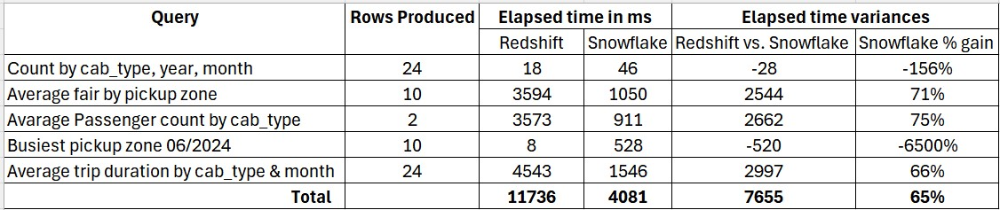

# 🌆 ZenClarity-UrbanFlow — NYC Taxi Data Engineering Project

**A modern, cloud-native data engineering platform that ingests NYC Taxi data via streaming and batch pipelines, transforms it with dbt, and delivers analytics in Redshift, Snowflake, and Streamlit.**  
ZenClarity-UrbanFlow demonstrates best practices in clarity, scalability, and modern cloud data engineering. It highlights near real-time ingestion, reproducible transformations, and cross-engine benchmarking to evaluate performance and cost-efficiency across **data warehouse engines**.

- 🚖 **Pipelines**: Real-time streaming via Kinesis + scheduled batch ingestion with AWS Glue  
- 🗄️ **Data Warehousing Engines**: Redshift Serverless and Snowflake, supporting analytics and benchmarking  
- 📊 **Modeling**: dbt with layered structure (staging → intermediate → marts)  
- ⚡ **Benchmarks**: Comparative performance tests across Redshift and Snowflake  
- 📈 **Visualization**: Streamlit dashboard delivering KPIs and real-time vs. baseline insights  

---

## 📊 Project Highlights

- **Data Ingestion**: Dual-pipeline system — Python-based simulator for live events via **Kinesis Firehose** and AWS Glue for scheduled batch ingestion.  
- **Data Lake & Storage**: Central **Amazon S3** data lake; **DynamoDB** used for observability and audit logging.  
- **Data Transformation**: ETL with **AWS Glue** and ELT with **dbt** (multi-layer: staging, intermediate, marts).  
- **Data Warehousing**:  
  - **Redshift Serverless** for streaming & batch analytics.  
  - **Snowflake** for bulk load + benchmarking.  
- **Orchestration**: **AWS Step Functions** automate and manage pipeline workflows.  
- **Visualization**: **Streamlit dashboard** surfaces KPIs and real-time vs baseline comparisons.  
- **Cross-Database Compatibility**: Custom **dbt macros** ensure the same models run seamlessly on both Redshift and Snowflake, enabling apples-to-apples benchmarking and portable analytics code.  

> Note: Streaming pipeline operates near-real-time (sub-minute latency) using fully managed AWS services.  

---

## 🗺️ Architecture

---

## 📂 Repo Structure 

ZenClarity-UrbanFlow/  
├── analytics/          # QuickSight & Streamlit app (screenshots archived)  
├── config/             # sample env/config snippets  
├── dbt/                # dbt models (staging → intermediate → marts)  
├── docs/               # diagrams, metrics, WBS planning notes  
├── infrastructure/     # EMR, Glue, Redshift, Snowflake configs  
├── scripts/            # ETL code (batch, streaming, emr_jobs, helpers)  
└── venv/               # local virtualenv (ignored in git)  

---

## 📈 Data Models & dbt

This project follows a **multi-layered dbt modeling pattern**, a best practice for building analytics code that is both maintainable and scalable. This approach ensures data quality, consistency, and reusability across the entire pipeline.

- **Staging**: cleans raw data, enforces schema.  
- **Intermediate**: joins + transformations for readability/efficiency.  
- **Marts**: business-defined entities for analytics (facts & dims).  

📑 **Documentation & lineage**:  The entire dbt project is documented and includes a full lineage graph, showcasing the flow of data from source to dashboard
[View dbt Project Documentation (S3 Hosted)](http://nle-dbt-docs.s3-website-us-east-1.amazonaws.com/#!/overview)

---

## 📊 Performance Benchmarks

A representative query pack was executed on both **Redshift** and **Snowflake** using dbt-built schemas.  

- ✅ Filters & partition pruning  
- ✅ Aggregations & group-by  

Results highlight performance trade-offs between Redshift and Snowflake under equivalent schema and query conditions:

---

## 📈 Dashboard KPIs (Streamlit)

* Trips count  
* Total fare revenue  
* Average trip delay  
* Passengers carried  
* Trips per minute  
* Real-time vs baseline comparison  
* Cumulative trip chart  

**Screenshots:**  

---

## 🌐 Technologies Used

**AWS Services:**  
S3 • Kinesis Firehose • Glue • Lambda • Step Functions • EventBridge • DynamoDB • Athena • Redshift Serverless  

**Other Tools:**  
dbt • Snowflake • Python • Streamlit  

---

## 📚 Roadmap

- **Next Phase: EMR Migration**  
  - Re-architect batch processing with Spark & Hive (EC2 + EMR Serverless).  
  - Compare cost & performance vs AWS Glue.  
  - Extend docs with tuning experiments.  

- **Future Enhancements**  
  - Iceberg tables / Athena for streaming cost optimization  
  - Predictive analytics (surge demand zones)  
  - More realistic simulation from historical patterns  

---

## 💡 Inspiration

> *"Modern Data Engineering: Combining batch + streaming for near real-time decision making."*

---

## 🔗 Connect

- LinkedIn: [le-nguyen-v](https://www.linkedin.com/in/le-nguyen-v/)  
- GitHub: [tropily](https://github.com/tropily/ZenClarity-UrbanFlow)
